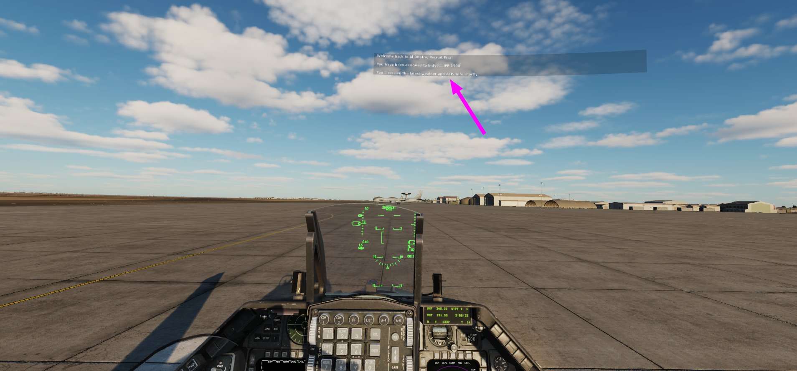

# DCS Messages Size Editor

 Very simple tool to edit the size of messages in the DCS UI, useful specially for VR users.




# How to use

No installation is required.
Just [download the latest released dcs_mse.exe](https://github.com/fisadev/dcs_mse/releases), place it in your DCS installation folder (not in Saved Games, but the game installation folder), and then run the executable. 

Then just follow its instructions.

# Paranoid mode

Don't trust the executable? If you know Python and Git, you can clone this repo, check the code, and run the source yourself too.
Run it using Python 3.10 or later and [UV](https://docs.astral.sh/uv/getting-started/installation/). You will need to specify the path to your DCS installation folder as an argument:

```bash
uv run dcs_mse.py "C:\Program Files\Eagle Dynamics\DCS World"
```
